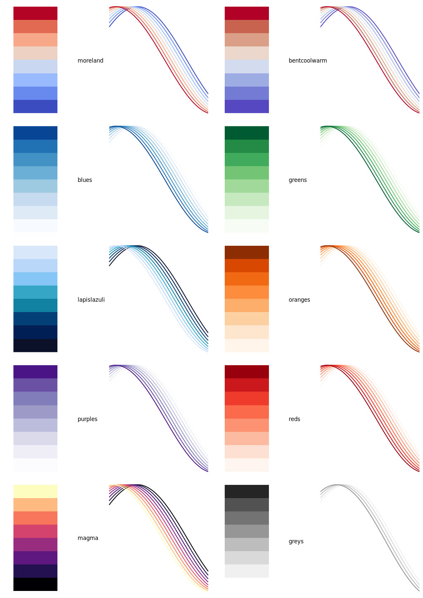

Color palettes for gnuplot
==========================

Color palettes can be used to color gradients of surface plots, contour plots and heat maps.
They are supported by gnuplot since at least version 4.2.

Single colored palettes ('reds', 'greens' etc) are sequential, where the lightness value increases monotonically through the colormaps.

Dual colored palettes ('bentcoolwarm') are diverging, and are good for emphasizing both extremes of ordered data, such as
maps of temperature deviation from a mean.

A good enterprise-grade palette is `moreland.palette`. A simplified version is `bentcoolwarm.palette`. Both are from
[Kenneth Moreland](https://www.kennethmoreland.com/color-maps/).

The `magma.palette` was copied from an original developed for [Matplotlib](https://matplotlib.org).

All other palettes are from [ColorBrewer](http://colorbrewer2.org/) and were
first ported to gnuplot by [Anna Schneider](https://github.com/aschn/gnuplot-colorbrewer).

These color palettes are included to show how color palettes can be used within `gnuplot_i`, and are purposefully not comprehensive.
More [examples](http://www.gnuplotting.org/tag/palette/) of usage of palettes in gnuplot.

To recreate the image above, use the `overview.gnuplot` script.
